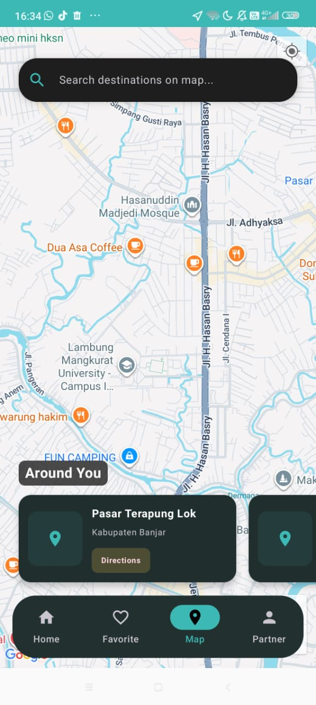
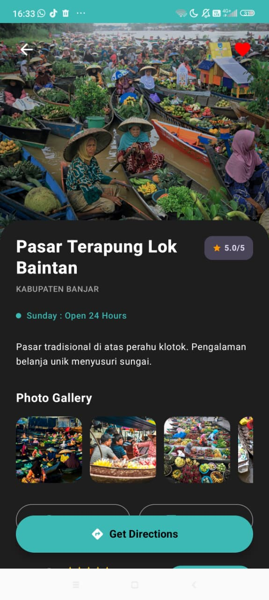
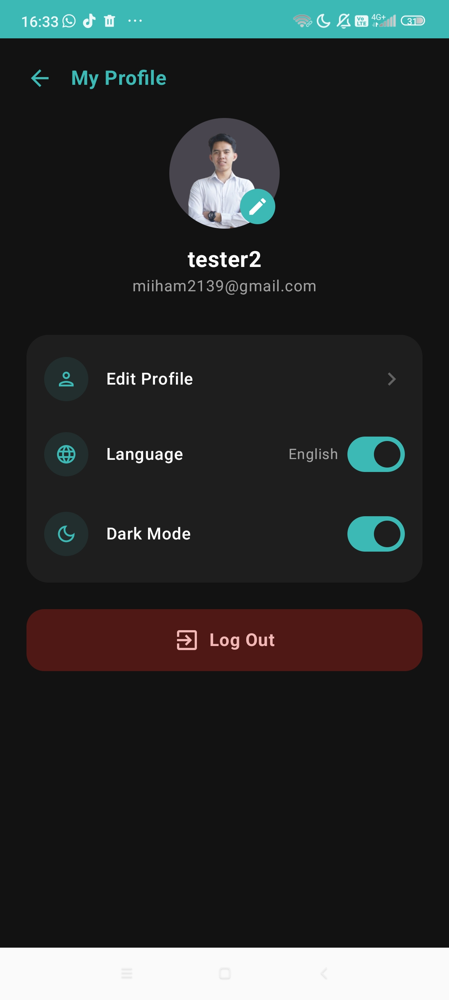

# 🌿 Banua Explorer

Banua Explorer merupakan aplikasi **Smart Tourism berbasis Android** yang membantu pengguna menemukan dan menjelajahi berbagai destinasi wisata di Kalimantan Selatan. Aplikasi ini menyediakan informasi destinasi, peta interaktif, rute perjalanan, profil Duta Pariwisata, serta fitur ulasan dan favorit dalam satu platform.

## 👨‍💻 Tim Pengembang

- Muhammad Ilham
- Daniel Noprianto

---

# 📱 Screenshot Aplikasi

Tambahkan screenshot aplikasi pada folder `screenshots/`.

| Home | Maps | Detail | Profile |
|------|------|--------|---------|
|  |  |  |  |

---

# ✨ Penjelasan Fitur

- **Home** → Menampilkan rekomendasi destinasi, kategori wisata, dan Duta Pariwisata.
- **Maps** → Menampilkan lokasi wisata beserta rute menuju destinasi.
- **Detail Destinasi** → Informasi lengkap destinasi, galeri foto, video, ulasan, dan navigasi.
- **Favorite** → Menyimpan destinasi favorit menggunakan Room Database.
- **Partner / Duta Pariwisata** → Menampilkan profil Duta Pariwisata Kalimantan Selatan.
- **Profile** → Menampilkan informasi akun pengguna dan pengaturan profil.
- **Edit Profile** → Mengubah nama, foto profil, dan informasi pengguna.
- **Review** → Menambahkan, melihat, mengedit, dan menghapus ulasan destinasi.

---

# ⚙️ Cara Instalasi

1. Clone repository.

```bash
git clone https://github.com/USERNAME/BanuaExplorer.git
```

2. Buka project menggunakan Android Studio.

3. Tambahkan file `google-services.json` ke folder `app/`.

4. Tambahkan API Key OpenRouteService pada file `local.properties`.

```properties
ORS_API_KEY=YOUR_API_KEY
```

5. Sync Gradle.

---

# ▶️ Cara Menjalankan Aplikasi

1. Jalankan Android Studio.
2. Pastikan emulator atau perangkat Android telah terhubung.
3. Klik **Run** atau tekan **Shift + F10**.
4. Login menggunakan akun yang telah terdaftar atau lakukan registrasi terlebih dahulu.

---

# 🌐 Informasi API yang Digunakan

| API / Layanan | Fungsi |
|--------------|--------|
| OpenRouteService API | Menghitung rute, jarak, dan estimasi perjalanan |
| Firebase Authentication | Login dan registrasi pengguna |
| Firebase Firestore | Penyimpanan data Duta Pariwisata dan data cloud |
| Google Maps | Menampilkan peta dan lokasi destinasi |

---

# 🏗️ Struktur Arsitektur Aplikasi

Aplikasi menggunakan **Clean Architecture** dengan pola **MVVM (Model-View-ViewModel)**.

```
Presentation
    │
    ▼
ViewModel
    │
    ▼
Domain (UseCase)
    │
    ▼
Repository
    │
 ┌──┴─────────┐
 ▼            ▼
Room      Firebase/API
```

- **Presentation** : Tampilan menggunakan Jetpack Compose.
- **ViewModel** : Mengelola state aplikasi menggunakan StateFlow.
- **Domain** : Berisi business logic dan use case.
- **Data** : Mengelola data dari Room Database, Firebase, dan API.

---

# ✅ Fitur Wajib

- Minimal 6 halaman aplikasi.
- Implementasi Recycle-able List menggunakan LazyRow/LazyColumn.
- Menggunakan Room Database sebagai penyimpanan lokal.
- Mengimplementasikan BREAD (Browse, Read, Add, Edit, Delete).
- Menggunakan API pihak ketiga (OpenRouteService).
- Menggunakan ViewModel dan StateFlow untuk mempertahankan state aplikasi.

---

# ⭐ Fitur Tambahan

- Login dan Register menggunakan Firebase Authentication.
- Data Duta Pariwisata terhubung dengan Firebase Firestore.
- Smart Routing dengan OpenRouteService API.
- Integrasi Google Maps untuk navigasi.
- Mendukung Light Mode dan Dark Mode.
- Sistem Favorite yang tersimpan secara lokal.
- Sistem Review destinasi dengan fitur tambah, edit, dan hapus.

---

# 🛠️ Teknologi yang Digunakan

- Kotlin
- Jetpack Compose
- MVVM
- Clean Architecture
- Room Database
- Firebase Authentication
- Firebase Firestore
- Google Maps Compose
- OpenRouteService API
- Retrofit
- Coil
- Coroutines
- StateFlow